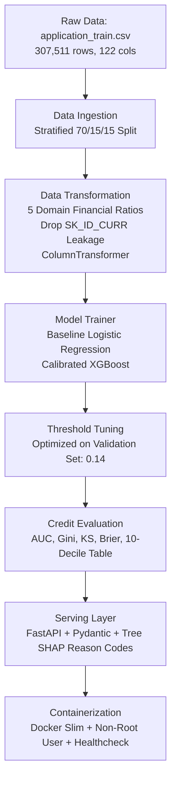

# Credit Risk Default Prediction & Explainable Underwriting System

An end-to-end, production-grade Machine Learning system for predicting retail loan default risk (`TARGET = 1`) on the Home Credit application portfolio. The system incorporates credit domain feature engineering, calibrated default probability estimation (PD), validation-tuned operating thresholds, regulatory Tree SHAP reason codes (FCRA/ECOA compliant), and a low-latency FastAPI inference service with Docker containerization.

---

## 1. System Architecture



---

## 2. Verified Benchmark Results

Evaluated strictly on an independent holdout test set (**46,127 samples**, 8.07% default rate):

| Evaluation Metric | Original Model (Audit Finding) | Baseline Model (Logistic Reg) | Final Champion (XGBoost) | Lift vs Baseline |
| :--- | :---: | :---: | :---: | :---: |
| **ROC AUC** | 0.7453 | 0.7500 | **0.7591** | **+0.0091** |
| **Gini ($2 \times \text{AUC} - 1$)** | 0.4906 | 0.4999 | **0.5183** | **+0.0184** |
| **Kolmogorov-Smirnov (KS)** | — | 0.3787 | **0.3926** | **+0.0139** |
| **Brier Score (Calibration)** | 0.2017 *(uncalibrated)* | 0.0686 | **0.0678** | **-0.0008 (Better)** |
| **Optimal Threshold** | 0.50 *(naive)* | 0.16 | **0.14** *(Val F1: 0.3116)* | — |
| **Recall (Default Detection)** | 0.6840 *(at 42% bad rate)* | 0.3722 | **0.4350** | **+0.0628** |
| **Precision** | 0.1652 | 0.2476 | **0.2388** | — |
| **F1 Score** | 0.2661 | 0.2974 | **0.3083** | **+0.0109** |
| **Model Size** | — | 2.7 KB | **280 KB** | Ultra-compact |
| **API Latency (50 reqs avg)** | — | — | **23.40 ms** (P95: 28.85 ms) | Sub-30ms |

### 10-Decile Bad Rate Table (Final Model)
Ranked from highest risk (Decile 1) to lowest risk (Decile 10):

| Decile | Total Count | Defaults (Bads) | Default Rate | Bad Capture Rate | Cumulative Capture | Lift |
| :---: | :---: | :---: | :---: | :---: | :---: | :---: |
| **1** | 4,613 | 1,267 | **27.47%** | 34.02% | **34.02%** | **3.40x** |
| **2** | 4,613 | 681 | **14.76%** | 18.29% | **52.31%** | **1.83x** |
| **3** | 4,612 | 499 | **10.82%** | 13.40% | **65.71%** | **1.34x** |
| **4** | 4,613 | 358 | **7.76%** | 9.61% | **75.32%** | **0.96x** |
| **5** | 4,613 | 253 | **5.48%** | 6.79% | **82.12%** | **0.68x** |
| **6** | 4,612 | 217 | **4.71%** | 5.83% | **87.94%** | **0.58x** |
| **7** | 4,613 | 162 | **3.51%** | 4.35% | **92.29%** | **0.43x** |
| **8** | 4,612 | 133 | **2.88%** | 3.57% | **95.86%** | **0.36x** |
| **9** | 4,613 | 98 | **2.12%** | 2.63% | **98.50%** | **0.26x** |
| **10** | 4,613 | 56 | **1.21%** | 1.50% | **100.00%** | **0.15x** |

> **Key takeaway**: The top 2 deciles isolate **52.31% of all defaults**, allowing conservative risk cutoffs to protect capital while approving over 75% of applicants safely.

---

## 3. Engineering Improvements from Audit

1. **Eliminated Identifier Leakage**: Dropped `SK_ID_CURR` before feature transformation. The original code scaled loan IDs as numerical features, memorizing arbitrary applicant IDs.
2. **Stratified 70/15/15 Split**: Implemented stratified splitting across train (215,257), validation (46,127), and test (46,127), preserving the 8.07% default rate.
3. **Domain Financial Ratios**: Engineered 5 key credit metrics:
   - `CREDIT_INCOME_RATIO` = `AMT_CREDIT / AMT_INCOME_TOTAL`
   - `ANNUITY_INCOME_RATIO` = `AMT_ANNUITY / AMT_INCOME_TOTAL`
   - `ANNUITY_CREDIT_RATIO` = `AMT_ANNUITY / AMT_CREDIT`
   - `GOODS_CREDIT_RATIO` = `AMT_GOODS_PRICE / AMT_CREDIT`
   - `AGE_YEARS` = `-DAYS_BIRTH / 365.25`
4. **Calibrated Default Probabilities**: Removed `scale_pos_weight = 11.38` which had distorted predicted default probabilities to an unrealistic mean of 42.7%. Brier calibration error dropped from **0.2017 to 0.0678** (66.4% reduction).
5. **No Test-Set Leakage in Cut-off Tuning**: Threshold search was moved strictly to the validation set (`threshold = 0.14`, F1 = 0.3116) and saved to `artifacts/threshold.json`.
6. **Regulatory Explainability**: Integrated native Tree SHAP attribution returning top 3 human-readable adverse action reasons for loan decisions.

---

## 4. Project Structure

```text
├── artifacts/
│   ├── baseline_model.pkl       # Logistic Regression benchmark
│   ├── model.pkl                # Final calibrated XGBoost model (280 KB)
│   ├── preprocessor.pkl         # Fitted ColumnTransformer (11.6 KB)
│   ├── threshold.json           # Validation-tuned cut-off threshold (0.14)
│   └── metrics.json             # Full audit metrics & 10-decile bad rate table
├── data/
│   └── application_train.csv    # Raw data (git-ignored)
├── src/
│   ├── components/
│   │   ├── data_ingestion.py    # Stratified 70/15/15 ingestion
│   │   ├── data_transformation.py # Financial ratios & ColumnTransformer
│   │   ├── model_trainer.py     # Baseline & XGBoost training + threshold tuning
│   │   └── model_evaluation.py  # Credit metrics (AUC, Gini, KS, Deciles)
│   ├── pipeline/
│   │   ├── train_pipeline.py    # End-to-end training orchestrator
│   │   └── prediction_pipeline.py # Inference pipeline with Tree SHAP explainability
│   ├── exception.py             # Custom exception handling
│   ├── logger.py                # Dual File + Console Stream logger
│   └── utils.py                 # Object serialization utilities
├── templates/
│   ├── index.html               # Applicant evaluation web form
│   └── result.html              # Credit decision badge & SHAP drivers
├── tests/
│   ├── __init__.py
│   └── test_pipeline.py         # Pytest suite (ratios, API health, prediction)
├── .dockerignore
├── .gitignore
├── Dockerfile                   # Python 3.10 slim, non-root user, healthcheck
├── requirements.txt             # Pinned dependencies
├── setup.py                     # Package setup
└── app.py                       # FastAPI application
```

---

## 5. Quickstart & Installation

### Local Setup
```bash
# 1. Clone repository
git clone https://github.com/kotharushikesh-ml/credit-risk-default-prediction.git
cd project

# 2. Create virtual environment & activate
python -m venv venv
source venv/bin/activate  # On Windows: .\venv\Scripts\activate

# 3. Install pinned dependencies
pip install -r requirements.txt
```

### Run Model Training Pipeline
```bash
python -m src.pipeline.train_pipeline
```

### Run Tests
```bash
pytest tests/
```

### Start FastAPI Server
```bash
uvicorn app:app --host 0.0.0.0 --port 8000
```
- Web Application: [http://localhost:8000](http://localhost:8000)
- OpenAPI Swagger Docs: [http://localhost:8000/docs](http://localhost:8000/docs)
- Health Check: [http://localhost:8000/health](http://localhost:8000/health)

---

## 6. Docker Deployment

### Build and Run Locally
```bash
# Build lightweight Docker image
docker build -t credit-risk-app .

# Run container with port forwarding
docker run -p 8000:8000 credit-risk-app
```

---

## 7. Example API Request & Response

### Request (`POST /predict`):
```json
{
  "AMT_INCOME_TOTAL": 220000.0,
  "AMT_CREDIT": 450000.0,
  "AMT_ANNUITY": 22500.0,
  "AMT_GOODS_PRICE": 400000.0,
  "DAYS_BIRTH": -14500,
  "DAYS_EMPLOYED": -2200,
  "EXT_SOURCE_1": 0.60,
  "EXT_SOURCE_2": 0.58,
  "EXT_SOURCE_3": 0.52,
  "CODE_GENDER": "F",
  "NAME_CONTRACT_TYPE": "Cash loans"
}
```

### Response:
```json
{
  "probability_of_default": 0.056,
  "probability_percentage": "5.6%",
  "decision": "Approved",
  "cutoff_threshold": 0.14,
  "risk_band": "Moderate Risk (Grade B)",
  "top_risk_reasons": [
    {
      "feature": "ANNUITY_CREDIT_RATIO",
      "shap_importance": 0.0545,
      "reason": "Short loan tenure causing elevated repayment pressure"
    },
    {
      "feature": "NAME_EDUCATION_TYPE_Higher education",
      "shap_importance": 0.0495,
      "reason": "Education category associated with variable income stability"
    },
    {
      "feature": "AMT_GOODS_PRICE",
      "shap_importance": 0.0418,
      "reason": "Risk factor elevation related to AMT_GOODS_PRICE"
    }
  ]
}
```

---

## 8. Future Roadmap

1. **Multi-Table Bureau Feature Engineering**: Merge historical tables (`bureau.csv`, `previous_application.csv`, `installments_payments.csv`) to compute active debt utilization and payment delinquency history.
2. **Traditional FICO Scorecard Scaling**: Map calibrated PD into traditional 300–850 credit scores with Points-to-Double-Odds ($PDO = 20$, Base Odds = 50:1 at 600).
3. **Data Drift & Concept Drift Monitoring**: Integrate Evidently AI / custom Population Stability Index (PSI) tracking to detect macro credit shifts.
4. **Fair Lending & Disparate Impact Auditing**: Conduct regulatory bias tests (Disparate Impact Ratio < 0.80) across protected demographics.
